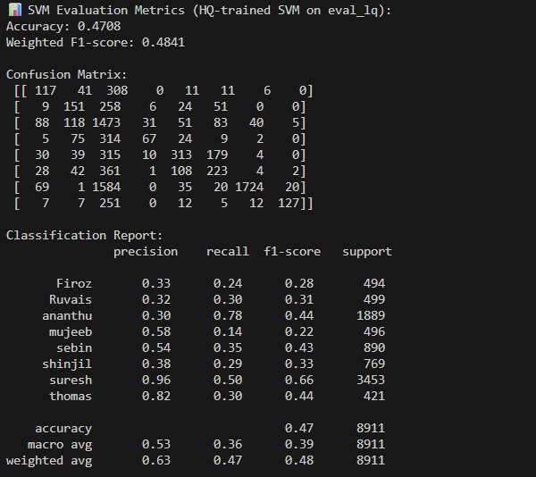
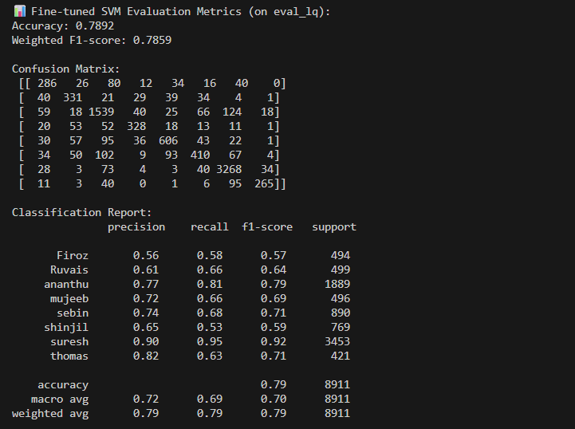

# FACE RECOGNITION 🎭

A project demonstrating face recognition on images using **FaceNet embeddings** and **SVM classifiers**. 
<br>
---
## Project Objective

- Implement a pre-trained FaceNet model to extract discriminative embeddings from facial images.
- Train and evaluate a **Support Vector Machine (SVM)** classifier on high-quality (HQ) and low-quality (LQ) images.
- Fine-tune the SVM using a mixed-quality dataset to improve classification accuracy on low-quality images.
- Provide detailed evaluation metrics including accuracy, F1-score, and confusion matrices.
  
---
## Directory Structure
```
face_recognition_project/
├── src/ # Source code scripts
│   ├── embeddings_extraction_hq.py
│   ├── embeddings_extraction_train_lq.py
│   ├── embeddings_extraction_eval_lq.py
│   ├── train_svm.py
│   ├── finetuning_svm.py
│   ├── finetuned_svm_main_test.py
│   └── plot_finetuned_confusion.py
├── data/ # Dataset (not included in repo)
│   ├── train/ # High-quality training images
│   ├── train_lq/ # Low-quality training images for fine-tuning
│   └── eval_lq/ # Low-quality evaluation images
├── images/
├── models/ # Saved SVM models
└── README.md

```

---

## Dataset Instructions

- **High-Quality (HQ) Images:** Used to train the initial SVM.  
- **Low-Quality (LQ) Images:** Split into:
  - `train_lq/` → used for SVM fine-tuning
  - `eval_lq/` → used strictly for evaluation (never for training)  

> ⚠️ The dataset is not included in the repository.

<br><br>
## Usage Instructions ⚠️⚠️⚠️⚠️

Follow these steps to replicate the training and evaluation pipeline for face recognition.
---
<br>
1. Extract Embeddings

Use the pre-trained FaceNet model to extract embeddings from your dataset.
```
embeddings_extracttion_hq.py  ->  extract embeddings from High-quality training images
embeddings_extraction_train_lq.py  ->  extract embeddings from train_lq
embedding_extraction_eval_lq.py  ->  extract embeddings from eval_lq
```
Input: data/train, data/train_lq, or data/eval_lq folders
Output: .pkl files containing embeddings and labels 

<br><br>
2. Train HQ SVM

Train a linear SVM classifier on embeddings extracted from high-quality images.
```
python src/train_svm.py
```
Input: HQ embeddings 
Output: models/svm_model.pkl (HQ-trained SVM)

<br><br>
3. Fine-Tune SVM on Mixed-Quality Embeddings

Train a new SVM on a combination of high-quality and low-quality embeddings to improve performance on degraded images.
```
python src/finetuning_svm.py
```
Input: HQ embeddings + train_lq embeddings
Output: models/svm_model_finetuned.pkl (fine-tuned SVM)

<br><br>
4. Evaluate SVM on Low-Quality Images

Evaluate fine-tuned SVM on the eval_lq dataset.
```
python src/finetuned_svm_main_test.py
```
Output:

Accuracy & F1-score
Classification report
Confusion matrix (printed in console)

<br><br>
5. Plot Confusion Matrix and ROC Curves

Generate visualizations for the classifier’s performance.
```
python src/plot_finetuned_confusion.py
```
Output: PNG images in the images/ 

<br><br>
### Note 📌⚡

Always use the evaluation set eval_lq only for testing; do not use it in training.

<br><br>
## SVM Evaluation Comparison

The following images compare the performance of the **HQ-trained SVM** vs the **Fine-Tuned SVM** on the low-quality evaluation set (`eval_lq`).

| HQ-trained SVM | Fine-Tuned SVM |
|----------------|----------------|
|  |  |

### Observations:
- **HQ-trained SVM:** Lower accuracy (~47%) on low-quality images due to domain mismatch between HQ training images and LQ evaluation images.  
- **Fine-Tuned SVM:** Significantly improved accuracy (~79%) by including low-quality embeddings during fine-tuning, demonstrating better generalization to degraded images.  
- Overall, fine-tuning the SVM on a mix of HQ and LQ embeddings improves per-class performance and reduces misclassification, especially for identities affected by image quality degradation.

